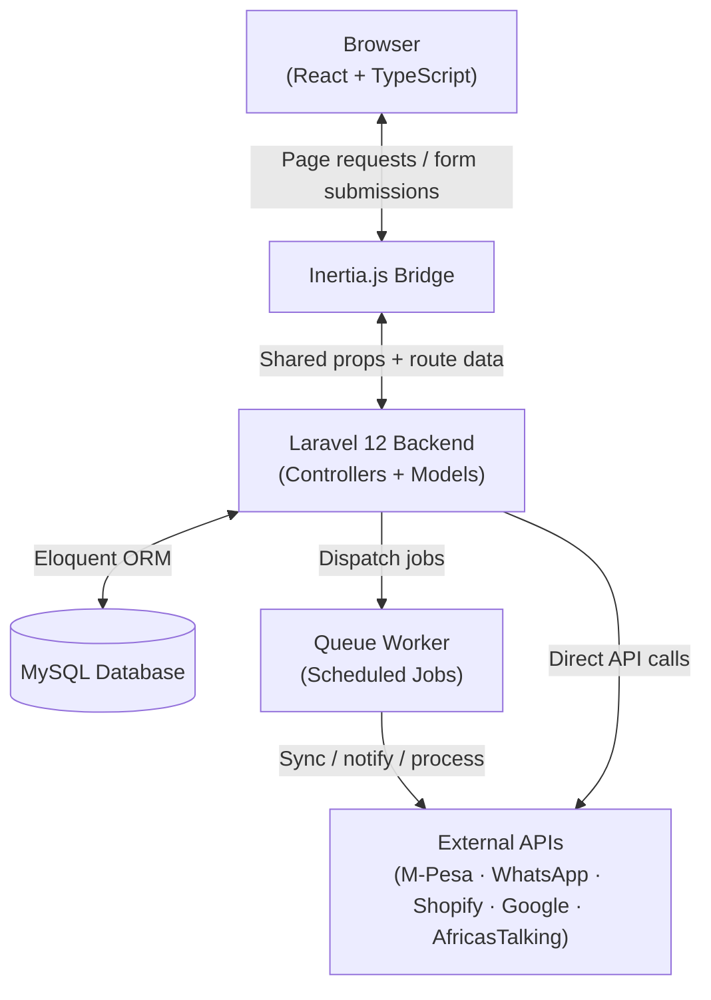
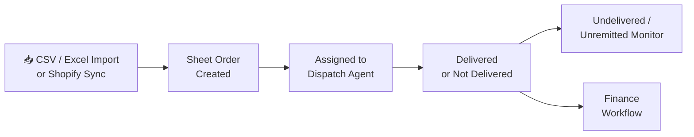
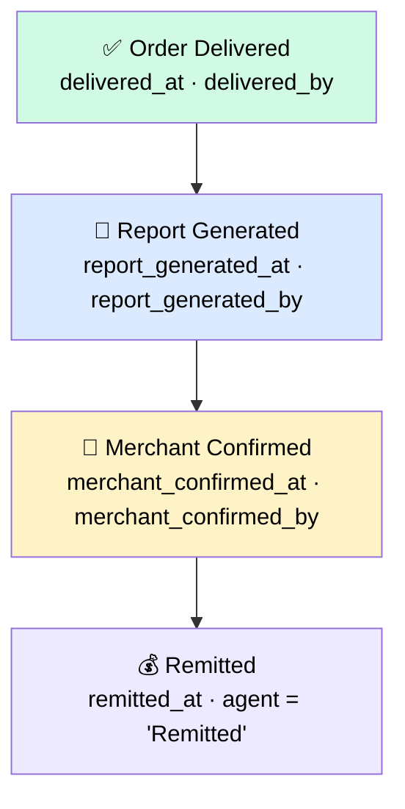
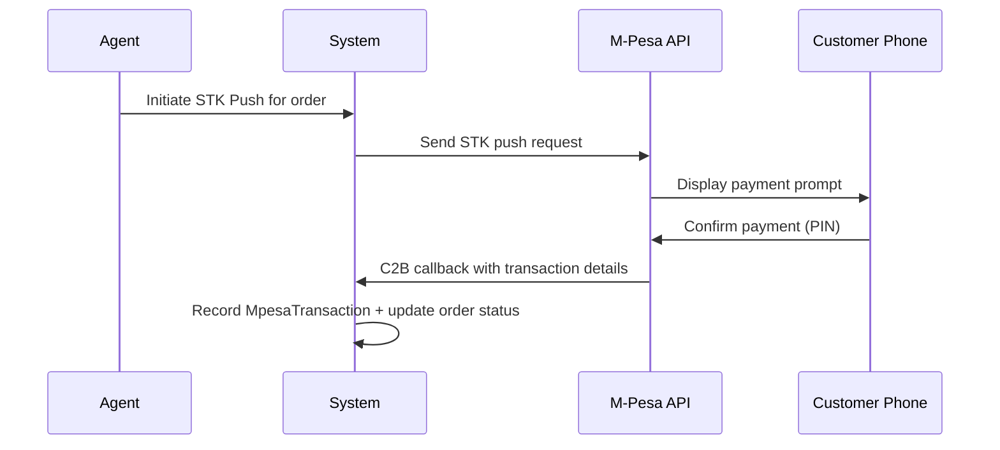
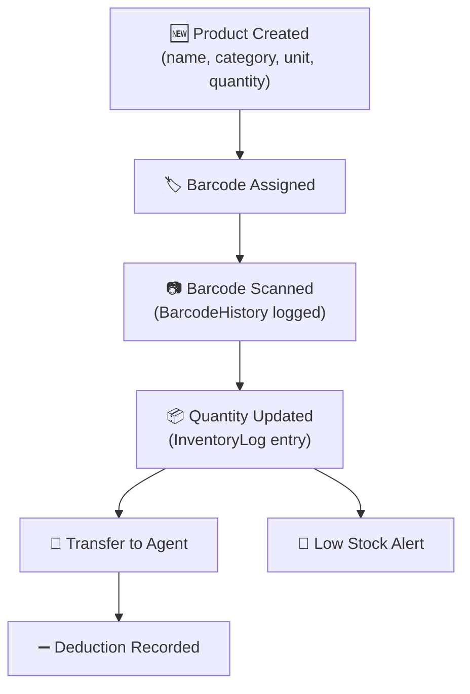
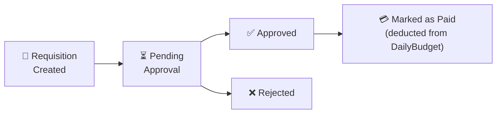
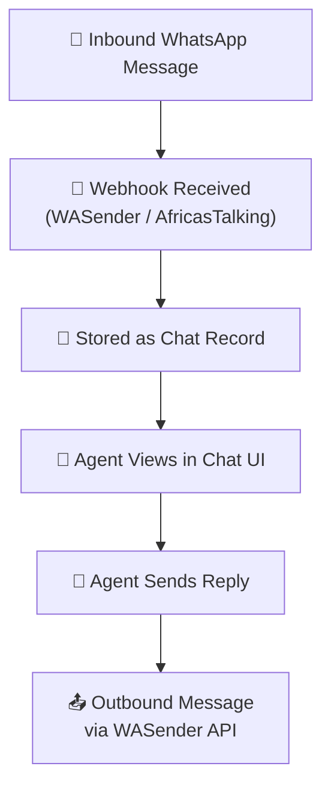
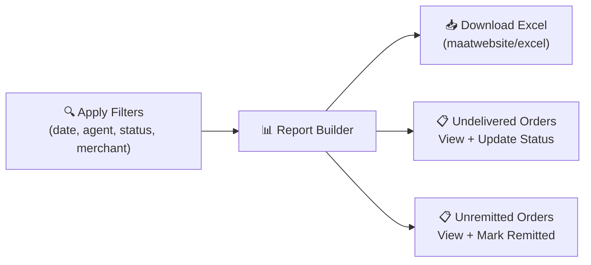
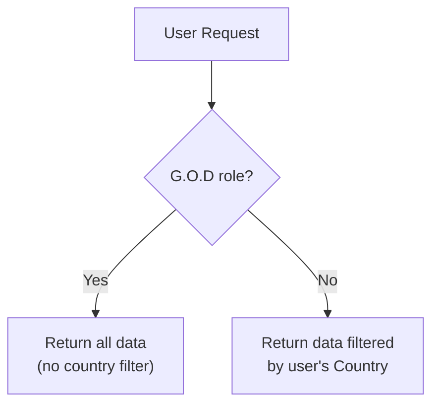

# RealDeal Logistics Operations System

> A full-stack logistics platform for managing orders, dispatch, warehouse, payments, finance, and back-office operations — built with Laravel 12 + React + Inertia.js.

   

---

## Overview

RealDeal is a logistics operations platform that centralises everything from order import to final payment remittance. Teams across dispatch, warehouse, finance, and communication all work from the same system, with role-based access controlling what each user can see and do.

**Who uses it:**

| Role | What they do |
|------|-------------|
| **Admin / G.O.D** | Full access across all countries and modules |
| **Finance** | Budget management, requisitions, report generation, remittance tracking |
| **Dispatch Agent** | View assigned orders, generate waybills, mark deliveries |
| **Warehouse** | Product management, barcode scanning, stock transfers |
| **Merchant** | View and confirm their own orders via the finance workflow |
| **Call Center** | WhatsApp/chat conversations, STK push, customer communication |

---

## Tech Stack

| Layer | Technology |
|-------|-----------|
| Backend | Laravel 12, PHP 8.2+ |
| Frontend | React 19, TypeScript |
| Bridge | Inertia.js + Ziggy |
| Styling | Tailwind CSS v4, Radix UI |
| Build | Vite |
| Database | MySQL (via Eloquent ORM) |
| PDF | barryvdh/laravel-dompdf |
| Excel | maatwebsite/excel |
| Barcodes | milon/barcode |

---

## System Architecture



---

## Modules & Workflows

### 1. Order Lifecycle

Orders start as raw CSV/Excel data and move through dispatch, delivery, and monitoring until they are fully remitted.



**Key pages:** `import`, `sheetorders`, `dispatch`, `undelivered`, `unremitted`

---

### 2. Finance Workflow

Once an order is delivered, it moves through a four-stage finance pipeline tracked with timestamps and user IDs at every step.



Each stage is gated — you cannot skip steps. Finance staff mark delivery and generate reports; merchants confirm; finance finalises remittance.

**Key pages:** `finance-workflow`

---

### 3. Payment Collection (STK Push / M-Pesa)

Agents initiate mobile payments directly from the system, which talks to M-Pesa and waits for the payment callback.



**Key pages:** `stk`

---

### 4. Inventory & Warehouse

Products are tracked from creation through barcode scanning, stock updates, agent transfers, and deductions.



**Key pages:** `products`, `transfer`, `waredash`

---

### 5. Requisition & Budget Approval

Finance teams create requisitions that go through an approval chain before being paid out from a daily budget.



Budgets have daily limits and can receive top-ups. Requisitions link to a `RequisitionCategory` and are associated with specific budget lines.

**Key pages:** `requisitions`, `budgets`

---

### 6. Communication (WhatsApp & Voice)

Inbound messages arrive via webhook, are stored as `Chat` records, and agents respond from the chat UI. Voice calls are handled via WebRTC endpoints.



**Key pages:** `whatsapp`

---

### 7. Reports & Monitoring



**Key pages:** `report`, `undelivered`, `unremitted`, `stats`

---

## Multi-Tenancy (Country Isolation)

Every user belongs to a `Country`. All queries are automatically scoped to the user's country via the `CountryAccess` helper class — users can only see data for their own country.

The **G.O.D** (admin) role bypasses country scoping and has global access across all countries.



---

## Role-Based Sidebar

The navigation menu is dynamically controlled per role. Admins configure which menu items each role can see via the **Sidebar Permissions** page. This is stored in `SidebarRolePermission` and delivered to the frontend via Inertia shared props.

---

## Key Integrations

| Integration | Purpose |
|-------------|---------|
| **M-Pesa (Daraja)** | STK push payment collection, C2B callbacks |
| **WASender** | WhatsApp messaging (inbound + outbound) |
| **AfricasTalking** | SMS / voice / telecom integrations |
| **Shopify** | Order sync from merchant stores |
| **Google API** | Google Sheets / Drive integrations |

---

## Scheduled Background Jobs

The system runs automated tasks via Laravel's scheduler and queue workers:

- Order reminder and overdue alerts
- Shopify order sync
- WhatsApp message queue processing
- C2B transaction callback handling
- Merchant sheet update synchronisation
- Location tracking heartbeat processing

---

## Development Setup

```bash
composer install
npm install
cp .env.example .env
php artisan key:generate
php artisan migrate
composer run dev
```

> `composer run dev` starts the Laravel server, queue worker, and Vite dev server concurrently.

## Deployment Notes

For Railway deployment setup, common build errors, and the fixes used in this project, see [`RAILWAY_SETUP.md`](/home/atlas/Downloads/rdl-mcp%20(2)/RAILWAY_SETUP.md).

---

## Notes

- Authentication and shared frontend state are handled through Inertia middleware (`HandleInertiaRequests`)
- The app supports both web routes (Inertia pages) and API endpoints (for webhooks and external integrations)
- Role-based access covers not just UI visibility but also controller-level guards
- All finance workflow steps are immutable audit trails — timestamps and user IDs are recorded and never overwritten
