# RealDeal Logistics Operations System

> A full-stack logistics platform for managing orders, dispatch, warehouse, payments, finance, and back-office operations — built with Laravel 12 + React + Inertia.js.

   

---

## Overview

RealDeal is a logistics operations platform that centralises everything from order import to final payment remittance. Teams across dispatch, warehouse, finance, and communication all work from the same system, with role-based access controlling what each user can see and do.

**Who uses it:**

| Role | What they do |
|------|-------------|
| **Admin / G.O.D** | Full access across all countries and modules |
| **Finance** | Budget management, requisitions, report generation, remittance tracking |
| **Dispatch Agent** | View assigned orders, generate waybills, mark deliveries |
| **Warehouse** | Product management, barcode scanning, stock transfers |
| **Merchant** | View and confirm their own orders via the finance workflow |
| **Call Center** | WhatsApp/chat conversations, STK push, customer communication |

---

## Tech Stack

| Layer | Technology |
|-------|-----------|
| Backend | Laravel 12, PHP 8.2+ |
| Frontend | React 19, TypeScript |
| Bridge | Inertia.js + Ziggy |
| Styling | Tailwind CSS v4, Radix UI |
| Build | Vite |
| Database | MySQL (via Eloquent ORM) |
| PDF | barryvdh/laravel-dompdf |
| Excel | maatwebsite/excel |
| Barcodes | milon/barcode |

---

## System Architecture

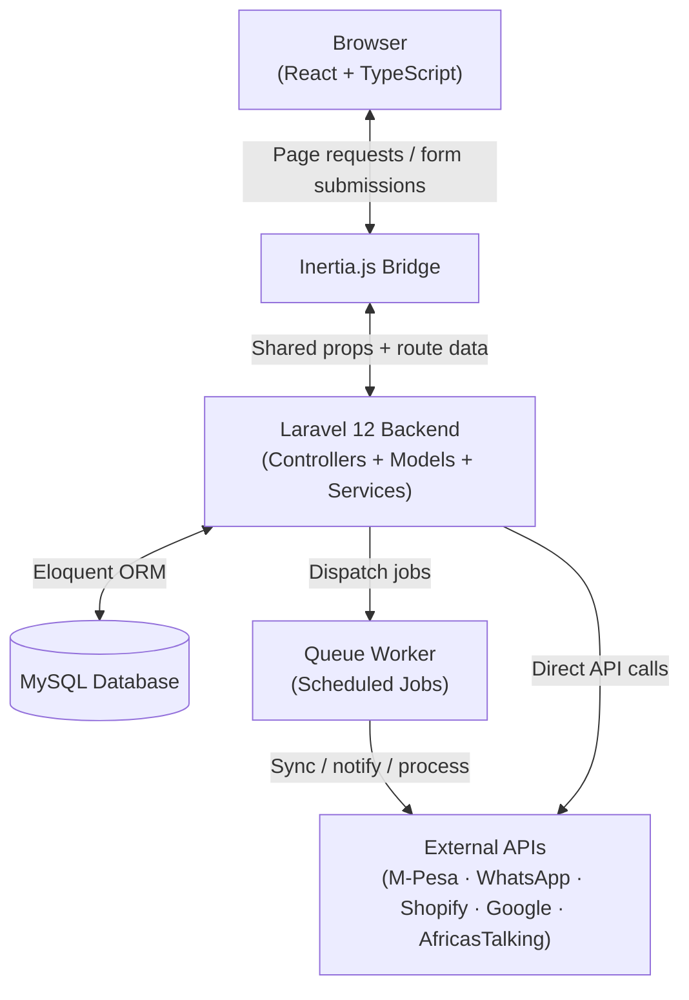

---

## Project Structure

```
├── app/
│   ├── Console/
│   │   └── Commands/          # Scheduled & CLI commands
│   ├── Exports/               # Excel/CSV export classes
│   ├── Http/
│   │   ├── Controllers/       # 40+ controllers (web + API)
│   │   ├── Middleware/         # Custom middleware
│   │   └── Requests/          # Form request validation
│   ├── Jobs/                  # Queueable jobs
│   ├── Models/                # 35 Eloquent models
│   ├── Providers/             # Service providers
│   ├── Services/              # Business logic services
│   └── Support/               # Helpers (CountryAccess, etc.)
├── config/                    # Laravel config files
├── database/
│   ├── migrations/            # 23 schema migrations
│   ├── factories/             # Model factories
│   └── seeders/               # Database seeders
├── resources/
│   ├── js/                    # React frontend
│   │   ├── components/        # Reusable UI components
│   │   ├── hooks/             # Custom React hooks
│   │   ├── layouts/           # Layout components
│   │   ├── lib/               # Utility functions
│   │   ├── pages/             # Inertia page components
│   │   └── types/             # TypeScript type definitions
│   └── views/                 # Blade templates
├── routes/
│   ├── web.php                # Web routes (Inertia pages)
│   ├── api.php                # API routes (webhooks, integrations)
│   ├── auth.php               # Auth routes
│   └── settings.php           # Settings routes
└── tests/                     # PHPUnit tests
```

---

## Modules & Workflows

### 1. Order Lifecycle

Orders start as raw CSV/Excel data and move through dispatch, delivery, and monitoring until they are fully remitted.

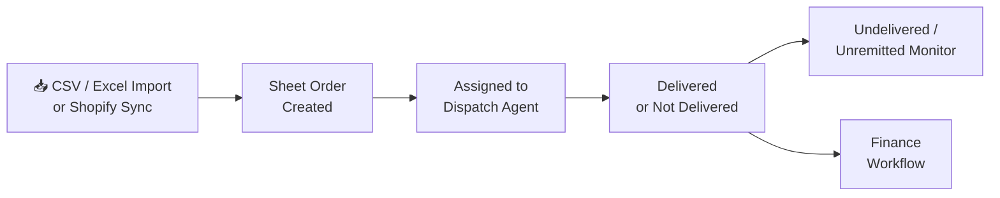

**Key pages:** `import`, `sheetorders`, `dispatch`, `undelivered`, `unremitted`

**Controllers:** `ImportController`, `SheetOrderController`, `DispatchController`, `UndeliveredController`, `UnremittedController`

---

### 2. Finance Workflow

Once an order is delivered, it moves through a four-stage finance pipeline tracked with timestamps and user IDs at every step.

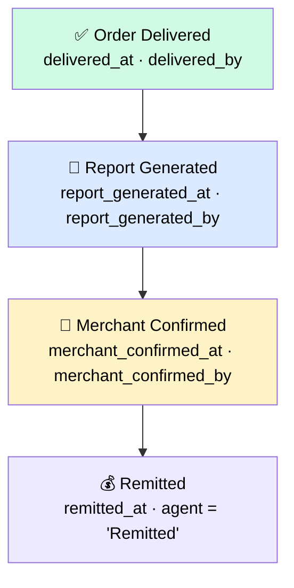

Each stage is gated — you cannot skip steps. Finance staff mark delivery and generate reports; merchants confirm; finance finalises remittance.

**Key pages:** `finance-workflow`

**Controller:** `FinanceWorkflowController`

---

### 3. Payment Collection (STK Push / M-Pesa)

Agents initiate mobile payments directly from the system, which talks to M-Pesa and waits for the payment callback.

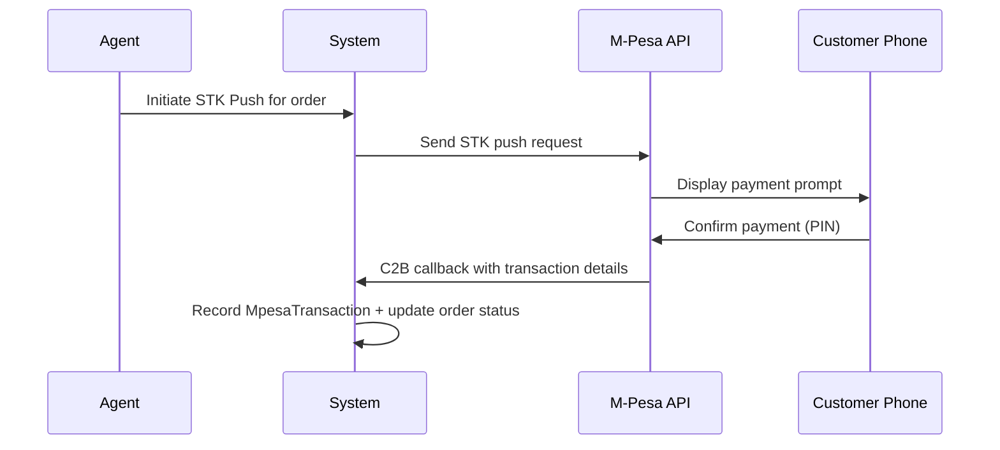

**Key pages:** `stk`

**Controllers:** `StkController`, `C2BTransactionController`

**Console Commands:** `ProcessC2BTransactions`

---

### 4. Inventory & Warehouse

Products are tracked from creation through barcode scanning, stock updates, agent transfers, and deductions.

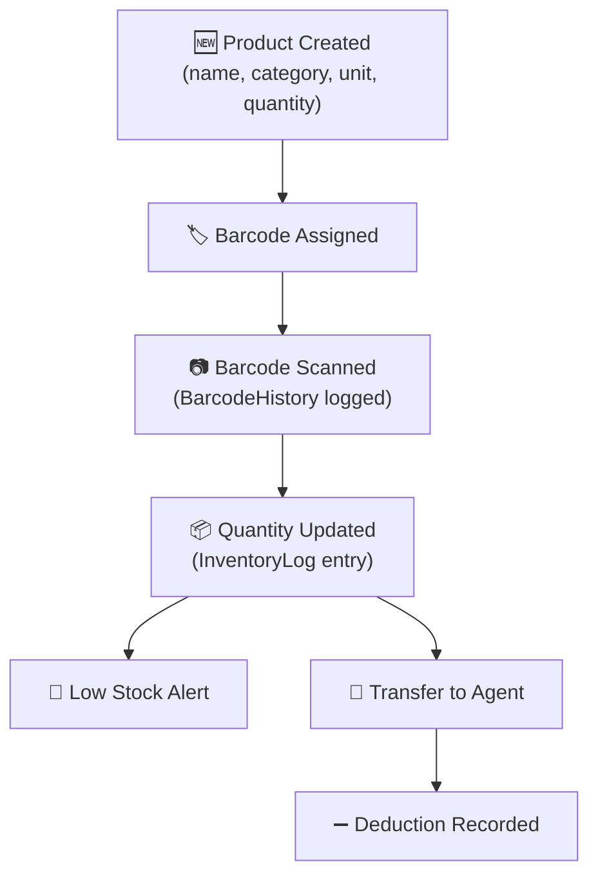

**Key pages:** `products`, `transfer`, `waredash`, `inventory-deductions`

**Controllers:** `ProductController`, `TransferController`, `InventoryDeductionController`, `WaredashController`

**Services:** `ProductStockAlertService`

---

### 5. Inventory Deduction Workflow

When delivered orders need inventory deducted from merchant stock:

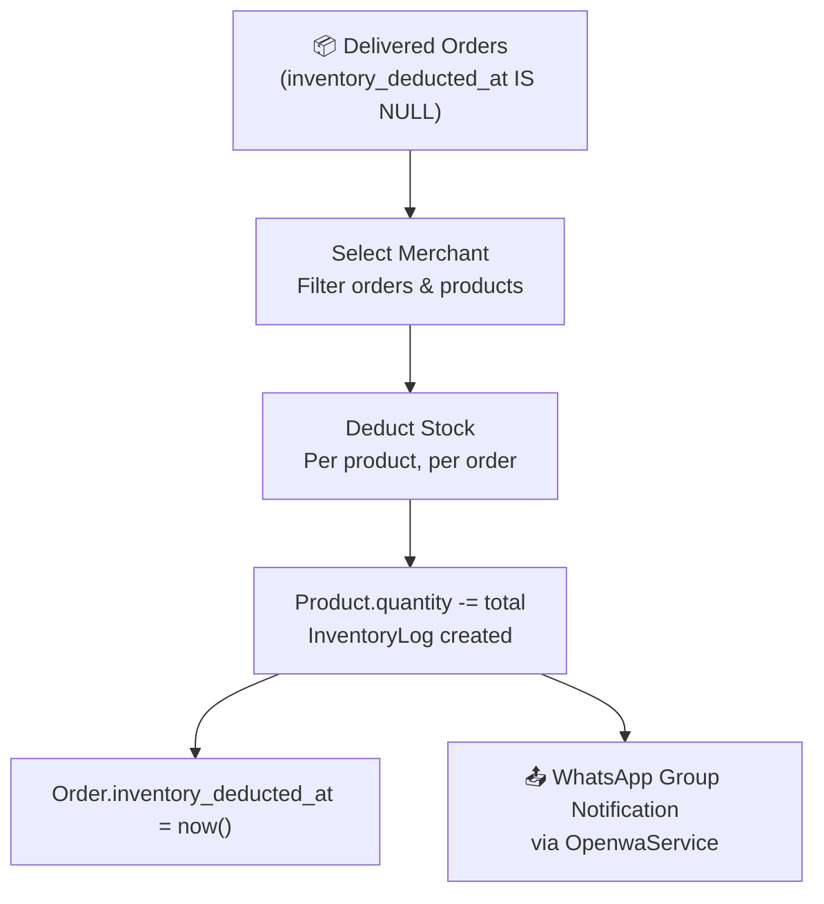

**Key pages:** `inventory-deductions`

**Controller:** `InventoryDeductionController`

---

### 6. Requisition & Budget Approval

Finance teams create requisitions that go through an approval chain before being paid out from a daily budget.

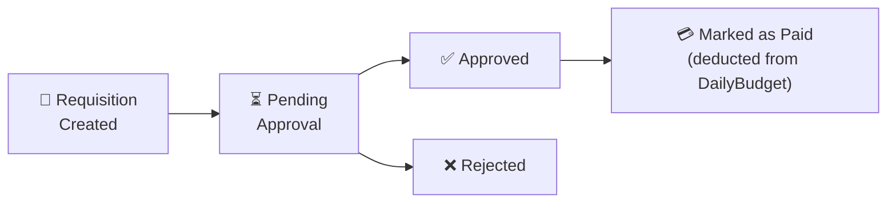

Budgets have daily limits and can receive top-ups. Requisitions link to a `RequisitionCategory` and are associated with specific budget lines.

**Key pages:** `requisitions`, `budgets`

**Controllers:** `RequisitionController`, `RequisitionCategoryController`, `DailyBudgetController`

---

### 7. Communication (WhatsApp & Voice)

RealDeal has a **layered WhatsApp messaging system** with multiple providers:

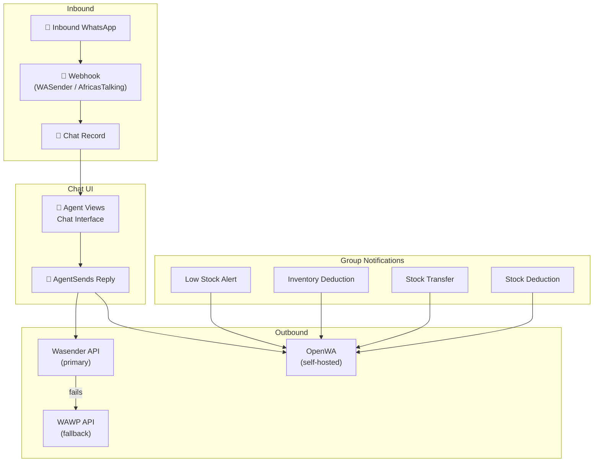

**Providers:**

| Provider | Role | Used By |
|----------|------|---------|
| **Wasender** | Primary outbound (chat replies) | `WhatsAppFallbackService`, `WhatsappController` |
| **WAWP** | Fallback (if Wasender fails) | `WhatsAppFallbackService` |
| **OpenWA** | Group notifications, fallback chat | `OpenwaService`, `WhatsappController` |

**Key pages:** `whatsapp`

**Controllers:** `WhatsappController`, `ChatController`

**Services:** `OpenwaService`, `WhatsAppFallbackService`

**Console Commands:** `SendWhatsAppMessage`

#### WhatsApp Group Notifications

Automated notifications are sent to country-specific WhatsApp groups instead of individual numbers:

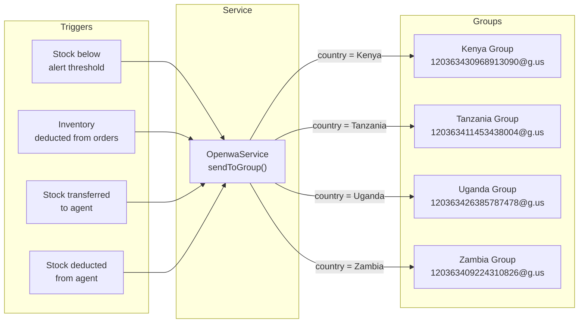

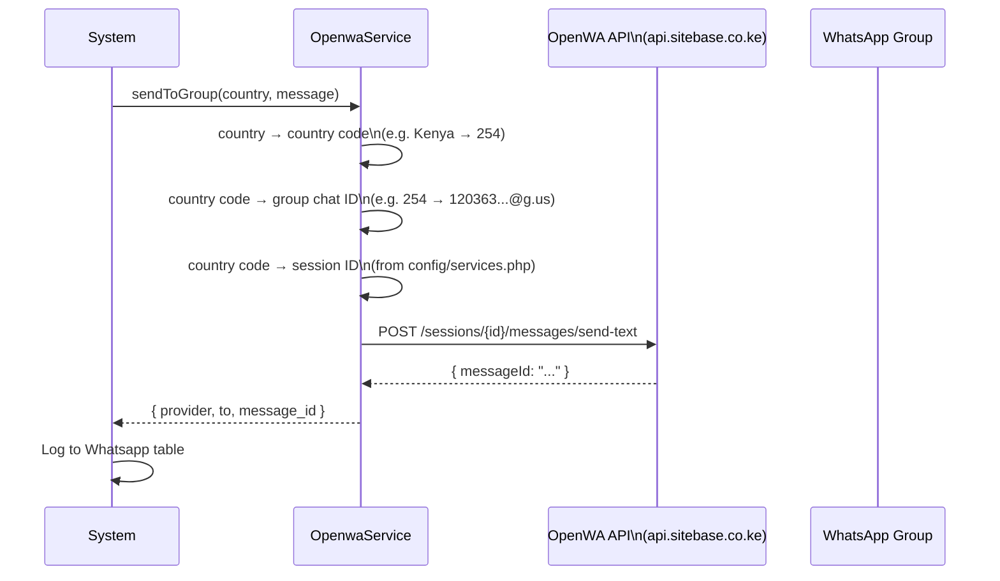

**Services involved:**
- `OpenwaService` — shared service used by `ProductStockAlertService`, `InventoryDeductionController`, and `TransferController`
- `ProductStockAlertService` — low stock threshold alerts
- `WhatsAppFallbackService` — Wasender → WAWP fallback for chat replies

---

### 8. Reports & Monitoring

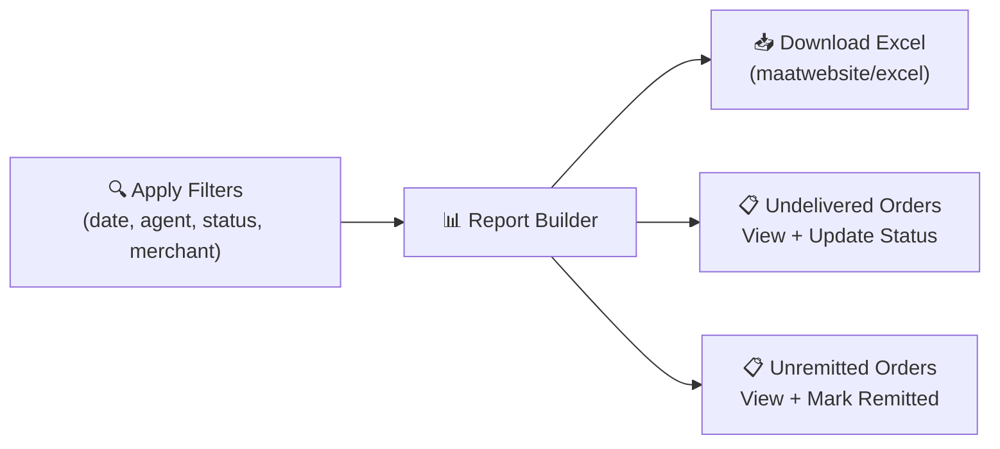

**Key pages:** `report`, `undelivered`, `unremitted`, `stats`

**Controllers:** `ReportController`, `StatsController`

**Services:** `DashboardReportService`, `StatsReportService`

---

### 9. Order Scanning (Warehouse Outbound/Inbound)

Warehouse staff scan product barcodes to process inbound and outbound operations:

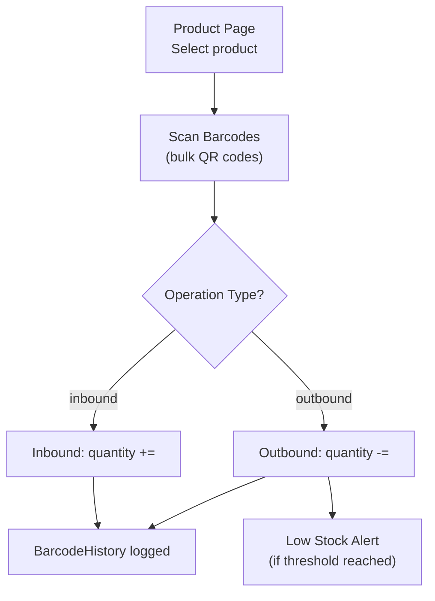

**Controllers:** `ProductController` (scanBarcodes method), `OrderScanController`

---

### 10. Dispatch & Waybills

Orders are assigned to dispatch agents who generate waybills and manage deliveries:

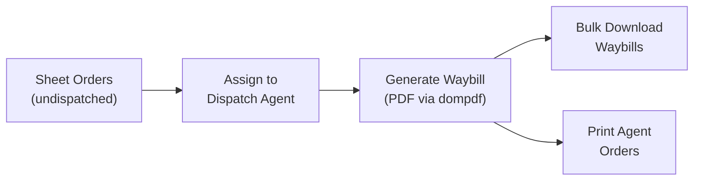

**Controllers:** `DispatchController`, `WaybillController`

---

## Multi-Tenancy (Country Isolation)

Every user belongs to a `Country`. All queries are automatically scoped to the user's country via the `CountryAccess` helper class — users can only see data for their own country.

The **G.O.D** (admin) role bypasses country scoping and has global access across all countries.

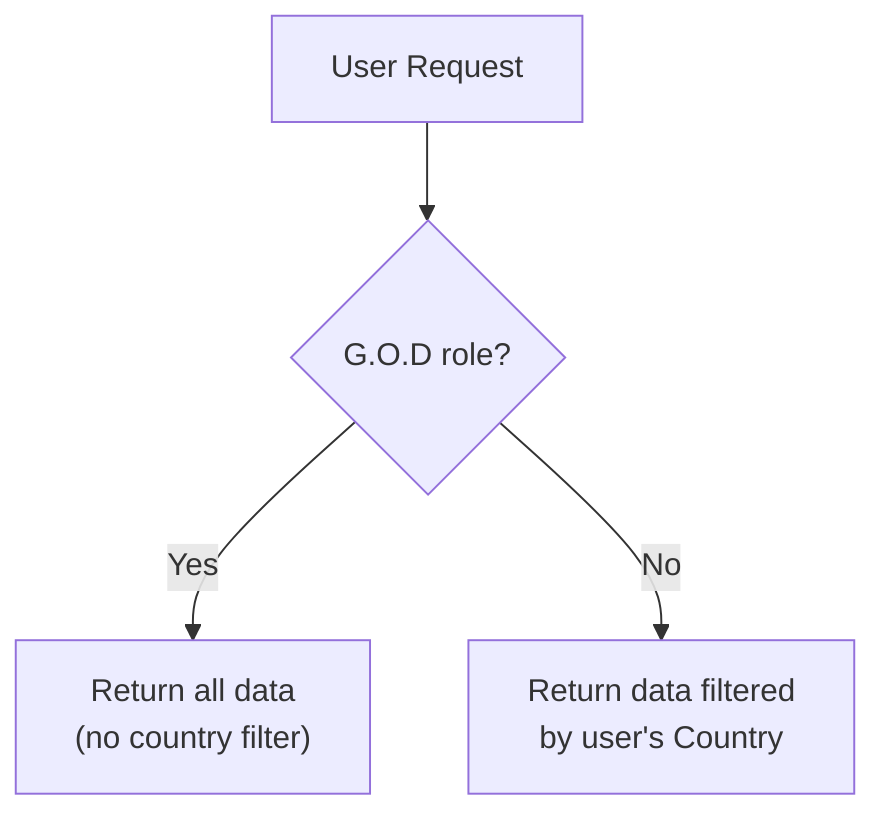

**Supported countries:**

| Country | Code | OpenWA Session Env Var |
|---------|------|------------------------|
| Kenya | 254 | `OPENWA_SESSION_KENYA` |
| Tanzania | 255 | `OPENWA_SESSION_TANZANIA` |
| Uganda | 256 | `OPENWA_SESSION_UGANDA` |
| Zambia | 260 | `OPENWA_SESSION_ZAMBIA` |

---

## Role-Based Sidebar

The navigation menu is dynamically controlled per role. Admins configure which menu items each role can see via the **Sidebar Permissions** page. This is stored in `SidebarRolePermission` and delivered to the frontend via Inertia shared props.

---

## Services Layer

| Service | Purpose |
|---------|---------|
| `OpenwaService` | Shared OpenWA messaging — sends to country groups or individual numbers |
| `WhatsAppFallbackService` | Wasender primary → WAWP fallback for chat replies |
| `ProductStockAlertService` | Low stock alerts via OpenWA groups |
| `DashboardReportService` | Dashboard statistics and charts |
| `StatsReportService` | Reporting and analytics |
| `SheetOrderImportService` | CSV/Excel import processing |
| `ShopifyService` | Shopify order sync |

---

## Key Integrations

| Integration | Purpose |
|-------------|---------|
| **M-Pesa (Daraja)** | STK push payment collection, C2B callbacks |
| **WASender** | WhatsApp messaging (inbound + outbound, primary) |
| **OpenWA (WaZuri)** | WhatsApp group notifications + fallback messaging |
| **WAWP** | WhatsApp fallback provider |
| **AfricasTalking** | SMS / voice / telecom integrations |
| **Shopify** | Order sync from merchant stores |
| **Google API** | Google Sheets / Drive integrations |

---

## Data Model (Key Tables)

| Table | Purpose |
|-------|---------|
| `countries` | Supported countries |
| `users` | All users with role and country assignment |
| `products` | Inventory products with quantity tracking |
| `sheet_orders` | Core order table with finance workflow columns |
| `incoming_sheet_orders` | Pre-processed imported orders |
| `sheets` | Merchant sheet groupings |
| `transfers` | Stock transfers to agents |
| `deductions` | Stock deductions from agents |
| `barcodes` | Scanned barcode history |
| `inventory_logs` | Quantity change audit trail |
| `stk` | STK push payment records |
| `mpesa_transactions` | M-Pesa C2B callback records |
| `c2b_transactions` | C2B transaction records |
| `requisitions` | Finance requisitions |
| `daily_budgets` | Daily budget tracking |
| `chats` / `whatsapp` | WhatsApp conversation records |
| `sidebare_role_permissions` | Dynamic sidebar visibility config |
| `dispatch` | Dispatch agent assignments |
| `voice_calls` | Voice call records |
| `user_locations` | Agent location tracking |

---

## Scheduled Background Jobs

The system runs automated tasks via Laravel's scheduler and queue workers:

| Command | Schedule | Purpose |
|---------|----------|---------|
| `NotifyOverdueOrders` | Daily | Overdue order alerts |
| `SendOverdueOrdersAlert` | Daily | Overdue summary to groups |
| `SendUpcomingOrdersReminder` | Daily | Upcoming delivery reminders |
| `SendScheduledOrders` | Varies | Scheduled order notifications |
| `ProcessC2BTransactions` | Every minute | Handle M-Pesa callback data |
| `ProcessSyncedOrders` | Varies | Process shopify-synced orders |
| `ImportShopifyOrders` | Hourly | Sync orders from Shopify |
| `SendWhatsAppMessage` | Varies | Queue-based WhatsApp delivery |
| `UpdateSheetOrders` | Varies | Merchant sheet sync |

---

## Development Setup

```bash
# Install dependencies
composer install
npm install

# Environment setup
cp .env.example .env
php artisan key:generate

# Database
php artisan migrate

# Start development servers (Laravel + Queue + Vite concurrently)
composer run dev
```

> `composer run dev` starts the Laravel server, queue worker, and Vite dev server concurrently.

### Linting & Type Checking

```bash
npm run lint        # ESLint
npm run types       # TypeScript type check
npm run format      # Prettier
composer run test   # PHPUnit
```

---

## Notes

- Authentication and shared frontend state are handled through Inertia middleware (`HandleInertiaRequests`)
- The app supports both web routes (Inertia pages) and API endpoints (for webhooks and external integrations)
- Role-based access covers not just UI visibility but also controller-level guards
- All finance workflow steps are immutable audit trails — timestamps and user IDs are recorded and never overwritten
- WhatsApp notifications are routed through `OpenwaService` which maps country names → country codes → group chat IDs → OpenWA session IDs
- The `ProductStockAlertService` uses constructor injection for `OpenwaService` — Laravel's service container auto-resolves it
